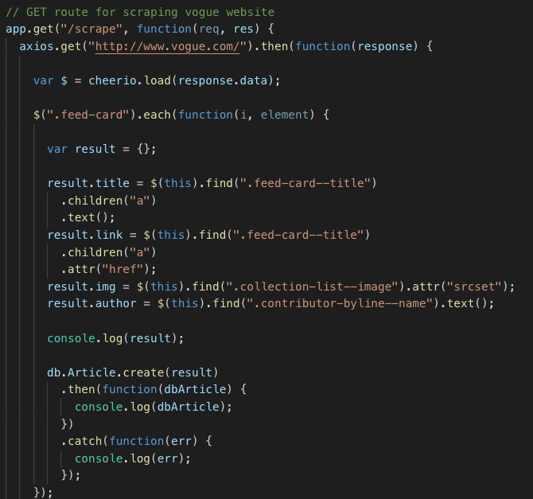

# Vogue Scraper

All the current top headline articles from Vogue, available at your fingertips for your accessiblility and curation. Users can save their favorite articles as well as comment on them. You can refresh the pge to load all the most recent content from [Vogue](www.vogue.com). 


## Getting Started

To use this app, you can either clone this repo down on your local device, or visit the deployed site [here](https://vogue-scraper.herokuapp.com/). 


### Installing

Install all dependencies by running 

```
npm i
```

in your terminal.


## Functionality

Use Vogue Scraper to save your favorite articles and leave comments.


## Code snippets

Required Axios and Cheerio to scrape data from vogue.com



## Deployment

Deployed on Heroku [here](https://vogue-scraper.herokuapp.com/).

## Built With

* [Mongodb](https://www.mongodb.com/) - used to create noSQL database
* [Mongoose](https://mongoosejs.com/) - used to develop schema for models
* [Morgan](https://www.npmjs.com/package/morgan) - HTTP request middleware for node.js
* [Axios](https://www.npmjs.com/package/axios) - used to make HTTP requests 
* [jQuery](https://jquery.com/) - JavaScript library used
* [Node.js](https://nodejs.org/en/) - JavaScript runtime
* [Cheerio](https://github.com/cheeriojs/cheerio) - used to scrape data
* [Express](https://www.npmjs.com/package/express) - web framework used
* [Express Handlebars]() - dynamically generated HTML pages


## Authors

* **Melika Kalbasi** - *Initial work* - [melikalbasi](https://github.com/melikalbasi)


## License

This project is licensed under the MIT License - see the [LICENSE.md](LICENSE.md) file for details
